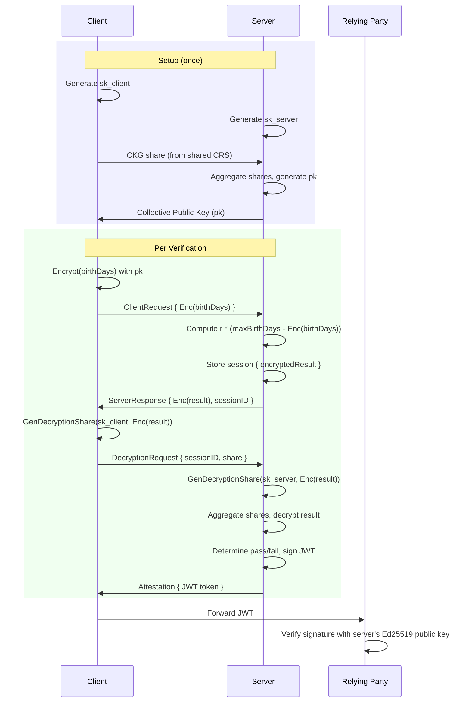

# homomorphic-age-verification

A demonstration of homomorphic encryption for privacy-preserving age verification using threshold (2-party) decryption and signed attestations, built with the [Lattigo](https://github.com/tuneinsight/lattigo) BGV scheme.

## How it works

The server needs to verify that a user is at least 18 years old, but the user doesn't want to reveal their exact birth date. Neither party can decrypt alone -- both must contribute decryption shares to reveal the computation result.

### Protocol



1. **Setup**: Both parties generate independent secret key shares and collaboratively produce a collective public key via CKG (Collective Key Generation) using a common reference string. This is a one-time ceremony.
2. **Client** encrypts their birth date (encoded as days since epoch) under the collective public key and sends the ciphertext to the server.
3. **Server** computes `r * (maxBirthDays - encryptedBirthDays)` homomorphically, where `r` is a random blinding factor. Returns the encrypted result and a session ID. The ciphertext stays encrypted under the collective key.
4. **Client** generates a decryption share (key-switching from `sk_client` toward `sk=0`) and sends it to the server along with the session ID.
5. **Server** generates its own decryption share, aggregates both, key-switches the ciphertext to `sk=0`, and trivially decrypts. It determines pass/fail (value <= p/2 means the difference was non-negative) and signs a JWT attestation.
6. **Relying parties** can independently verify the JWT using the server's Ed25519 public key.

### Security properties

- **Server** never sees the plaintext birth date (it only operates on ciphertexts encrypted under the collective key, which requires both shares to decrypt).
- **Client** cannot forge the result -- the server performs the decryption and determines pass/fail.
- **Client** cannot learn the exact age threshold from its decryption share -- the random blinding factor `r` (with ~24 bits of entropy) obscures the raw difference.
- **Neither party can decrypt alone** -- both secret key shares are needed. The noise flooding (sigma = 8 \* default noise) prevents a party from learning information about the other's secret key from decryption shares.
- **Relying party** only sees the signed attestation (age >= 18: true/false), nothing else.

### Date encoding

Dates are converted to days since Jan 1, 1900 rather than using YYYYMMDD integers. This compresses the value range (~16 bits) and leaves room in the 41-bit plaintext modulus (`0x10000048001`) for the multiplicative blinding factor.

## Running

```bash
go run .
```

## Testing

```bash
go test -v
```

## Benchmarks

```bash
go test -bench=. -benchmem
```
