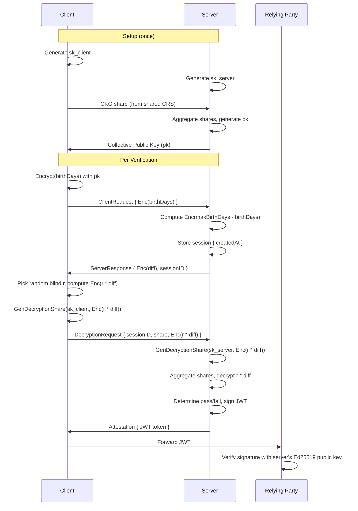

# homomorphic-age-verification

A demonstration of homomorphic encryption for privacy-preserving age verification using threshold (2-party) decryption and signed attestations, built with the [Lattigo](https://github.com/tuneinsight/lattigo) BGV scheme.

## How it works

The server needs to verify that a user is at least 18 years old, but the user doesn't want to reveal their exact birth date. And the server doesn't want the client to know what the age threshold is. Neither party can decrypt alone -- both must contribute decryption shares to reveal the computation result.

### Protocol



1. **Setup**: Both parties generate independent secret key shares and collaboratively produce a collective public key via CKG (Collective Key Generation) using a common reference string. This is a one-time ceremony.
2. **Client** encrypts their birth date (encoded as days since epoch) under the collective public key and sends the ciphertext to the server. Because the collective key is tied to the sum of both secret keys, neither party can decrypt the ciphertext alone.
3. **Server** computes `maxBirthDays - Enc(birthDays)` homomorphically. Returns the encrypted difference and a session ID. The ciphertext stays encrypted under the collective key — the server cannot decrypt it alone.
4. **Client** picks a random blinding factor `r` and computes `Enc(r * diff)`. It generates a decryption share against this blinded ciphertext and sends the share, the blinded ciphertext, and the session ID to the server.
5. **Server** generates its own decryption share against the blinded ciphertext, aggregates both shares, key-switches to `sk=0`, and trivially decrypts `r * diff`. It determines pass/fail (value <= p/2 means the original difference was non-negative) and signs a JWT attestation.
6. **Relying parties** can independently verify the JWT using the server's Ed25519 public key.

### Security properties

- **Server** never sees the plaintext birth date — it only operates on ciphertexts encrypted under the collective key, which requires both shares to decrypt.
- **Server** cannot recover the exact birth date from the decrypted result — the client chose the blinding factor `r`, so the server only sees `r * diff` and cannot divide out `r`.
- **Client** cannot forge the result — the server performs the final decryption and determines pass/fail.
- **Client** cannot learn the exact age threshold — the server's response is an encrypted difference under the collective key, which the client cannot decrypt alone. The client computes `maxBlind` from a conservative public bound (worst-case: person born at epoch verified today) so it doesn't leak the threshold.
- **Neither party can decrypt alone** — both secret key shares are needed. Noise flooding (sigma = 8 \* default noise) prevents a party from learning information about the other's secret key from decryption shares.
- **Decryption shares are ciphertext-bound** — a share generated for the blinded ciphertext cannot be used to decrypt the original unblinded ciphertext, because shares incorporate the ciphertext's `c1` polynomial.
- **Relying party** only sees the signed attestation (age >= 18: true/false), nothing else.

### Date encoding

Dates are converted to days since Jan 1, 1900 rather than using YYYYMMDD integers. This compresses the value range (~16 bits) and leaves room in the 41-bit plaintext modulus (`0x10000048001`) for the multiplicative blinding factor.

## Running

```bash
go run .
```

## Testing

```bash
go test -v
```

## Benchmarks

```bash
go test -bench=. -benchmem
```
